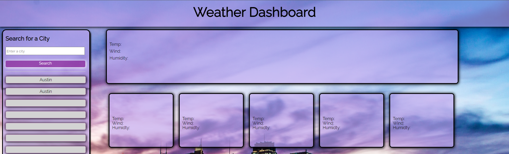

# weather-application

## Description

This repository hosts a weather dashboard. Utilizing this weather dashboard you can search cities all over the United States to check weather conditions. Upon entering a city to search you will be presented with current day information as well as a five day forecast.

Each day is equipped with information such as (date, temperature, wind speed, and humdity) as well as a complimented icon representing the weather. 

This application is completely responsive and is designed to work well on a desktop, laptop, tablet, and phone.

The search input will save the previous cities you have searched for securing the results for that city. This will allow the user to switch between recently visted forecast for multiple cities with ease. If you would like to reset your local storage, you can do so by hitting the reset button at the bottom of the search container.

## Technologies

- HTML  
- CSS
- JavaScript 
- Openweathermap API

## Credits

- Collaboration and ideas with James Kelly https://www.linkedin.com/in/james-kelly-b93a94150/
- Background photo by https://unsplash.com/@centelm (Clement Falize)

## Screenshots (Deployable Page Link)
Deployed page: https://fabien1313.github.io/weather-application/ 

## License

MIT License

Copyright (c) 2022 fabien1313

Permission is hereby granted, free of charge, to any person obtaining a copy
of this software and associated documentation files (the "Software"), to deal
in the Software without restriction, including without limitation the rights
to use, copy, modify, merge, publish, distribute, sublicense, and/or sell
copies of the Software, and to permit persons to whom the Software is
furnished to do so, subject to the following conditions:

The above copyright notice and this permission notice shall be included in all
copies or substantial portions of the Software.

THE SOFTWARE IS PROVIDED "AS IS", WITHOUT WARRANTY OF ANY KIND, EXPRESS OR
IMPLIED, INCLUDING BUT NOT LIMITED TO THE WARRANTIES OF MERCHANTABILITY,
FITNESS FOR A PARTICULAR PURPOSE AND NONINFRINGEMENT. IN NO EVENT SHALL THE
AUTHORS OR COPYRIGHT HOLDERS BE LIABLE FOR ANY CLAIM, DAMAGES OR OTHER
LIABILITY, WHETHER IN AN ACTION OF CONTRACT, TORT OR OTHERWISE, ARISING FROM,
OUT OF OR IN CONNECTION WITH THE SOFTWARE OR THE USE OR OTHER DEALINGS IN THE
SOFTWARE.